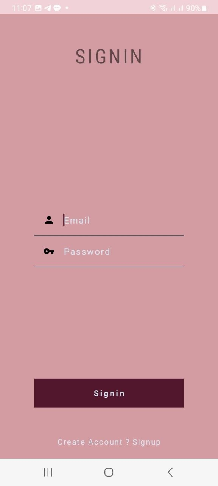
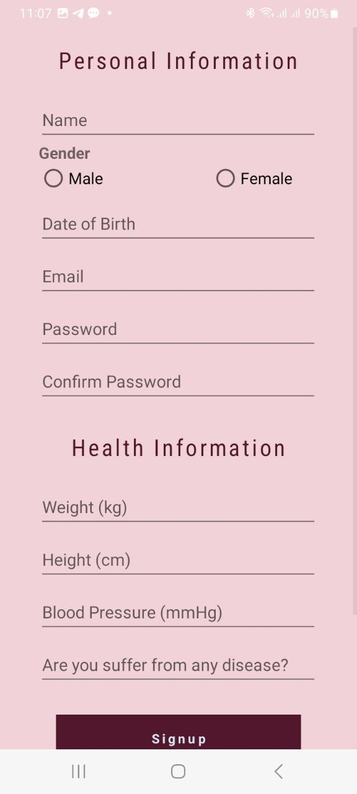
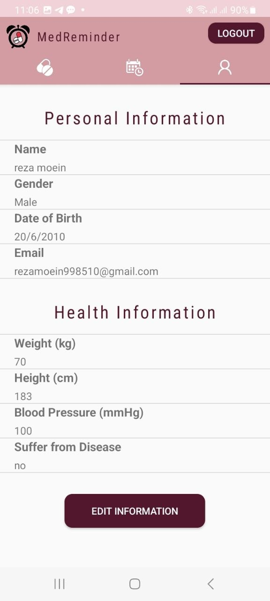
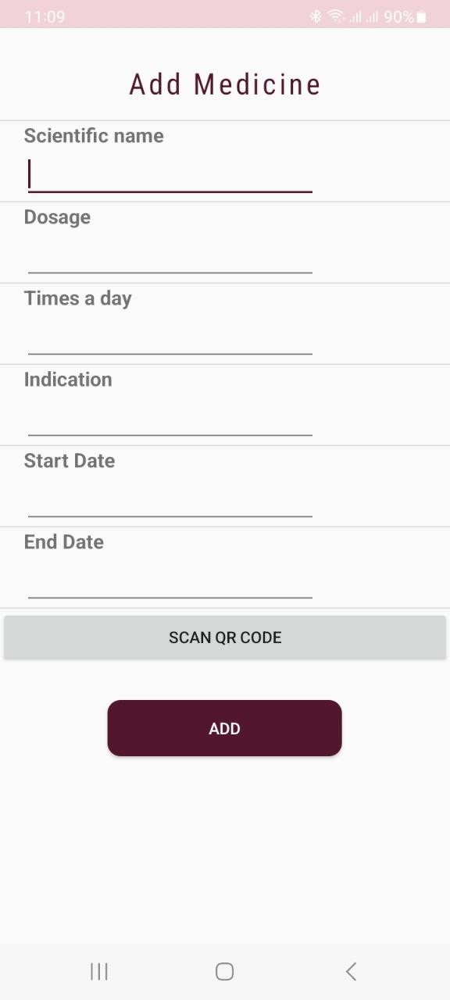
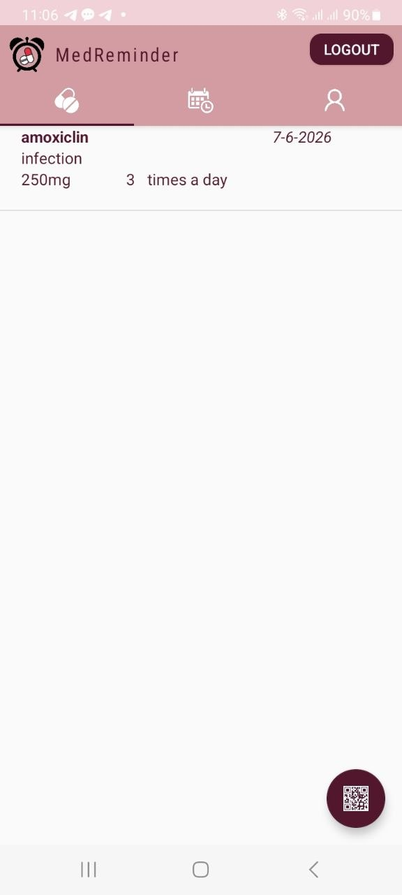
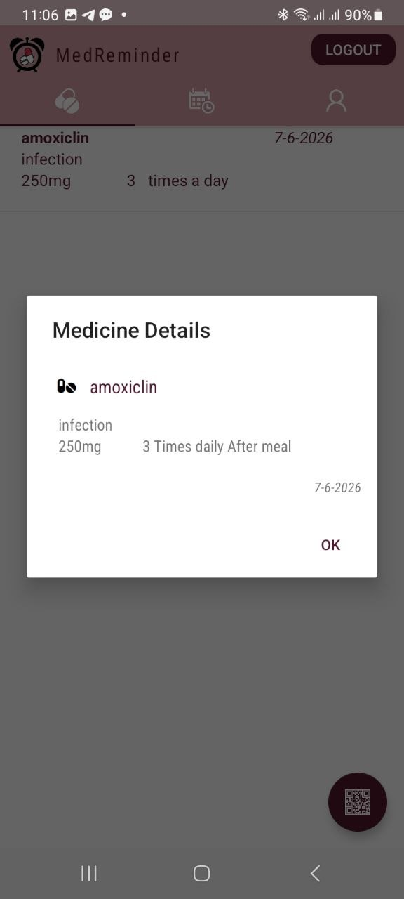
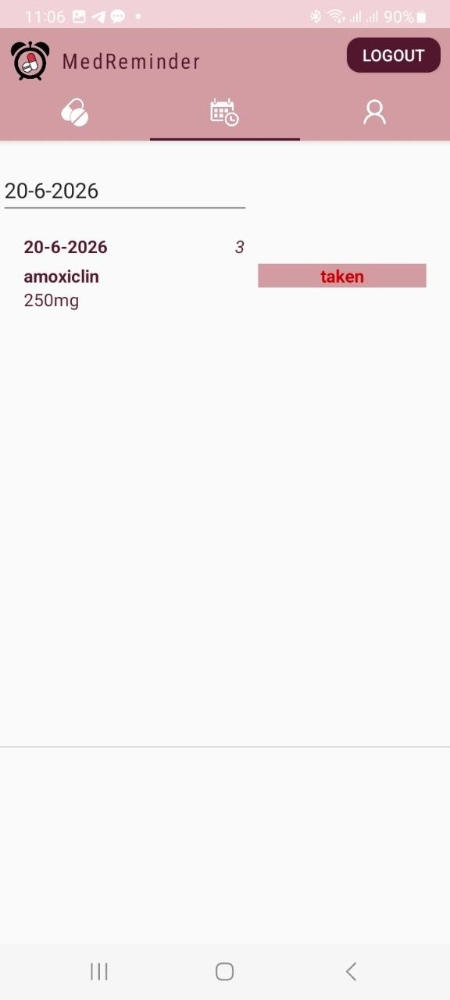
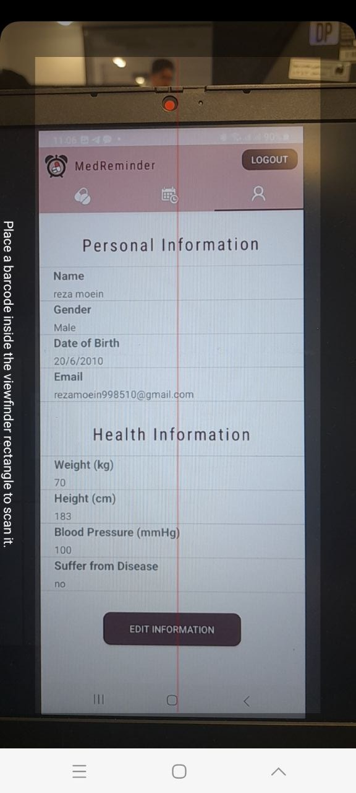

# MedReminder

MedReminder is a native Android application for managing medicine records and tracking medicine intake. The app helps users register their profile, add medicines manually or by scanning a QR code, view saved medicines, update intake status, and receive reminder notifications.

This version was changed to work offline. The original project expected a PHP backend and a server IP address, but the current implementation stores the main app data locally on the Android device using `SharedPreferences` and JSON through `LocalStore`.

## Current App Flow

The current app does not need a public server, domain, local IP, or internet connection for the main workflow.

1. The user signs up inside the app.
2. User/profile data is saved locally on the phone.
3. The user signs in with the locally saved email and password.
4. Medicines are added manually or from QR code data.
5. Medicines and intake status are stored locally.
6. The intake screen shows medicines for a selected date.
7. The user can mark a medicine as `taken`.
8. Reminder notifications are handled by Android alarm/notification components.

## Features

- Offline sign up and sign in
- Local profile storage and profile editing
- Add medicines manually
- Fill medicine form from QR code JSON
- View saved medicine list
- View medicine details
- Track medicine intake status by date
- Mark medicine status as taken
- Reminder notification support

## Tech Stack

| Area | Technology |
| --- | --- |
| Platform | Android |
| Main language | Java |
| Secondary language | Kotlin |
| UI | XML layouts |
| Lists | RecyclerView |
| Local storage | SharedPreferences + JSON |
| QR scanning | ZXing Android Embedded |
| Notifications | AlarmManager, BroadcastReceiver, NotificationManager |
| Build system | Gradle |

## Offline Data Architecture

The current data flow is:

```text
User
  -> Android screens
  -> LocalStore
  -> SharedPreferences + JSON
```

Medicine reminders follow this flow:

```text
Medicine status
  -> AlarmManager
  -> AlarmReceiver
  -> Notification
```

## Previous Server-Based Design

The original codebase included PHP/API based flows such as:

```text
signin.php
signup.php
medicine-add.php
medicine-view1.php
medicine-status-view.php
medicine-status-update.php
profile-edit.php
```

That version required a reachable PHP server and database. The current version does not use that server for the main app flow because local/offline storage is simpler to run and test without hosting.

## Screenshots

### Sign In and Sign Up

<p>
  
  
</p>

### Profile and Add Medicine

<p>
  
  
</p>

### Medicine List and Details

<p>
  
  
</p>

### Intake Status and QR Scanner

<p>
  
  
</p>

## QR Code Format

The medicine QR scanner expects JSON data like this:

```json
{
  "name": "amoxiclin",
  "dose": "250mg",
  "freq": "3 times a day",
  "indication": "infection",
  "sdate": "7-6-2026",
  "edate": "20-6-2026"
}
```

## Build

This project uses Gradle. To build the debug APK:

```powershell
.\gradlew.bat assembleDebug
```

The generated APK will be located at:

```text
app/build/outputs/apk/debug/app-debug.apk
```

## Notes

- Data is stored only on the device where the app is installed.
- Data is not synchronized between devices.
- If the app is uninstalled, local app data may be removed.
- For a production multi-device app, the storage layer should be upgraded to Room/SQLite or a real backend service.
